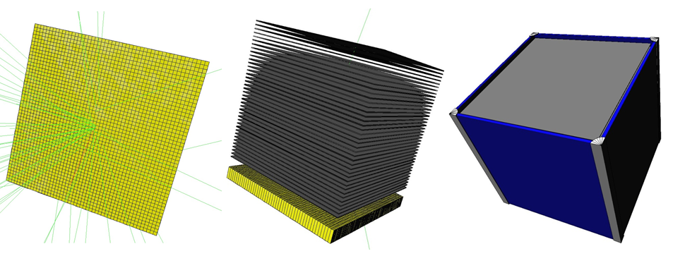
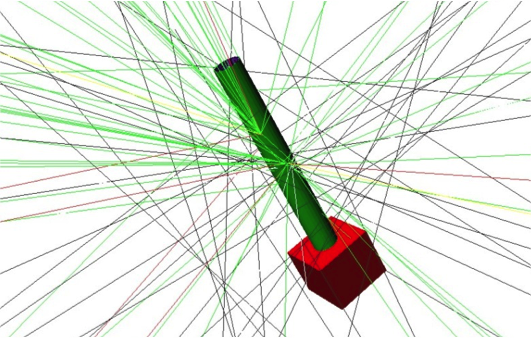

BoGEMMS (Bologna Geant4 Multi-Mission Simulator) is a free, open-access simulation framework based on the Geant4 toolkit. Fully customisable, it allows the user to build a 3D model of the high energy mission/experiment using configuration files. The output is formatted in Astronomy-oriented ROOT and FITS files to allow the post-processing of the simulation output as a real observation in space. BoGEMMS aims for a user-friendly simulation of the scientific performance (e.g. angular resolution, effective area, background level) of X-ray and gamma-ray space telescopes. The framework can also used for the simulation of any laboratory experiment where high energy interactions are involved.

### [Getting started](started.md)

### [References](references.md)

###### Authors: V. Fioretti and A. Bulgarelli (INAF OAS Bologna)
